# 🥤 PepsiCo Drink Detection - Vietnam Market

<div align="center">


**Detection and Recognition of PepsiCo Beverage Products in Vietnam Market**

[Dataset](#-dataset) • [Model](#-model) • [Results](#-training-results) • [Deployment](#-mobile-deployment) • [Usage](#-usage)

</div>

---

## 📋 Table of Contents

- [Introduction](#-introduction)
- [Dataset](#-dataset)
- [Model](#-model)
- [Training Results](#-training-results)
- [Model Comparison](#-model-comparison)
- [Mobile Deployment](#-mobile-deployment)
- [Installation & Usage](#-installation--usage)
- [Project Structure](#-project-structure)
- [Roadmap](#-roadmap)
- [Contributing](#-contributing)
- [License](#-license)

---

## 🎯 Introduction

This is a research and development project for an automated detection system for **PepsiCo** beverage products in the Vietnam market. The project uses the **YOLOv11 Nano** model - one of the most modern, compact, and efficient object detection models available today.

### ✨ Highlights

- 🏷️ **60 product labels** popular in Vietnam
- 📸 **~1000 images** collected from real-world scenarios and manually labeled
- 🚀 **YOLOv11 Nano** - High speed, compact size
- 📱 **TFLite Quantization** - Optimized for mobile deployment
- 💙 **Flutter Integration** - Successfully deployed on mobile application

---

## 📊 Dataset

### Dataset Information

- **Number of images**: ~1000 images
- **Number of classes**: 60 labels
- **Source**: Collected from real-world scenarios in Vietnam market
- **Labeling**: Manually annotated
- **License**: MIT

### Product Lines

The dataset includes the following main product lines:

#### 🥤 Pepsi Series

- Pepsi (bottle 1500ml, 390ml, 600ml, can 320ml)
- Pepsi zero calorie (bottle 390ml, can 320ml)
- Pepsi lime zero calorie (bottle 1500ml, 390ml, can 320ml)

#### 🍊 Mirinda Series

- Mirinda orange (bottle 1500ml, 390ml, can 320ml)
- Mirinda pineapple (bottle 1500ml, 390ml, can 320ml)
- Mirinda sarsi (bottle 1500ml, 390ml, can 320ml)
- Mirinda cream soda (bottle 1500ml, 390ml, can 320ml)

#### 🟢 7UP Series

- 7UP (bottle 1500ml, 390ml, 600ml, can 320ml)
- 7UP lemon soda (can 320ml)

#### 💧 Aquafina Series

- Aquafina (bottle 355ml, 500ml, 1500ml, 5000ml)
- Aquafina soda (can)

#### 🍵 Lipton Tea+ Series

- Lemon tea (bottle 330ml, 450ml, 1L)
- Tropical peach tea (bottle 450ml, 1L)
- Original tea (bottle 330ml, 450ml, 1L)
- Green oolong tea (bottle 450ml, 1L)
- Zero calorie tea (bottle 450ml)

#### ⚡ Sting Series

- Sting red (bottle 390ml, 500ml, can 320ml)
- Sting yellow (bottle 390ml, can 320ml)
- Sting blueberry (can 320ml)

#### 🍹 Other Lines

- Twister orange (bottle 390ml, 450ml, 1L, can 320ml)
- Revive (white bottle, lemon salt, zero calorie)
- Rockstar (can)
- Boss Coffee (can)
- Goodmood (yogurt, strawberry)

### 🔗 Access Dataset

The dataset is hosted on Roboflow and can be accessed at:

**🔗 [Roboflow Dataset Link](https://universe.roboflow.com/jinlearn/drink_detection_vn-z4vpu/dataset/4)**

```yaml
workspace: jinlearn
project: drink_detection_vn-z4vpu
version: 4
```

---

## 🤖 Model

### Model Architecture

- **Base Model**: YOLOv11 Nano (`yolo11n.pt`)
- **Framework**: Ultralytics YOLO
- **Input Size**: 640x640
- **Classes**: 60 PepsiCo products

### Training Configuration

```python
epochs: 40
batch_size: 8
image_size: 640
optimizer: AdamW (default)
augmentation: Auto (Ultralytics default)
```

### Model Exports

After training, the model is exported to multiple formats:

1. **PyTorch** (`.pt`) - Original model, highest accuracy
2. **ONNX** (`.onnx`) - Optimized for inference
3. **TensorFlow Lite Float32** (`.tflite`) - For mobile deployment
4. **TensorFlow Lite Float16** (`.tflite`) - Quantized, 50% size reduction

---

## 📈 Training Results

### Training Metrics

The model was trained for **40 epochs** with batch size 8 and achieved impressive results:


**Metrics achieved:**

- ✅ Loss decreases steadily across epochs
- ✅ mAP50 and mAP50-95 increase consistently
- ✅ Good balance between Precision and Recall
- ✅ No signs of overfitting

### Confusion Matrix

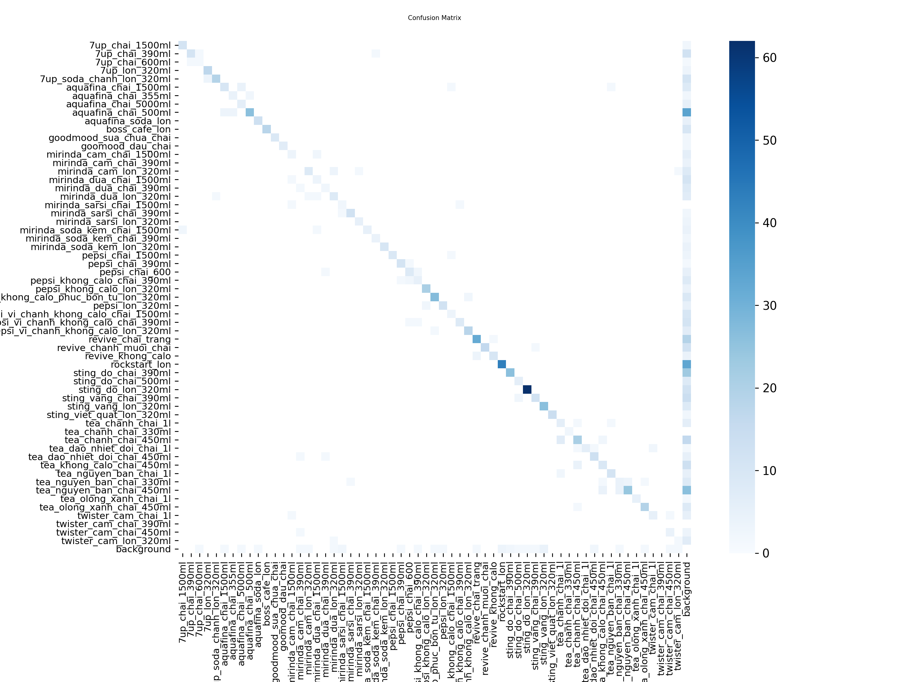

**Analysis:**

- ✨ Model classifies most classes well
- 🎯 Strong diagonal indicates high accuracy
- 🔍 Minor confusion between products with similar packaging (e.g., various Pepsi 320ml, Mirinda flavors)
- 💡 Good background detection with few false positives

---

## 🔬 Model Comparison

### Comparison: PyTorch (.pt) vs TFLite Float16

Below are the comparison results between the original PyTorch model (`best.pt`) and the quantized TFLite model (`best_float16.tflite`) on the same test set:

#### Test Image 1

<div align="center">

|          PyTorch Model           |           TFLite Float16            |
| :------------------------------: | :---------------------------------: |
| 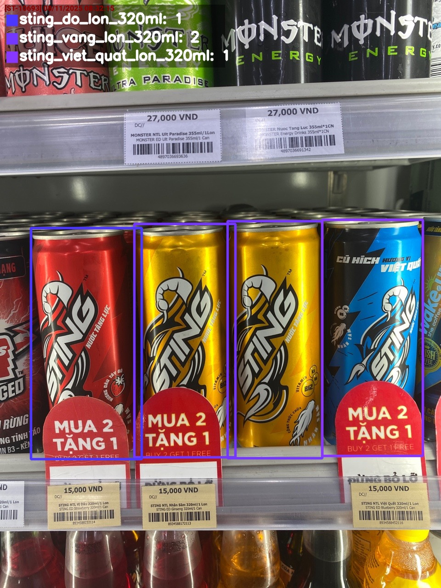 | 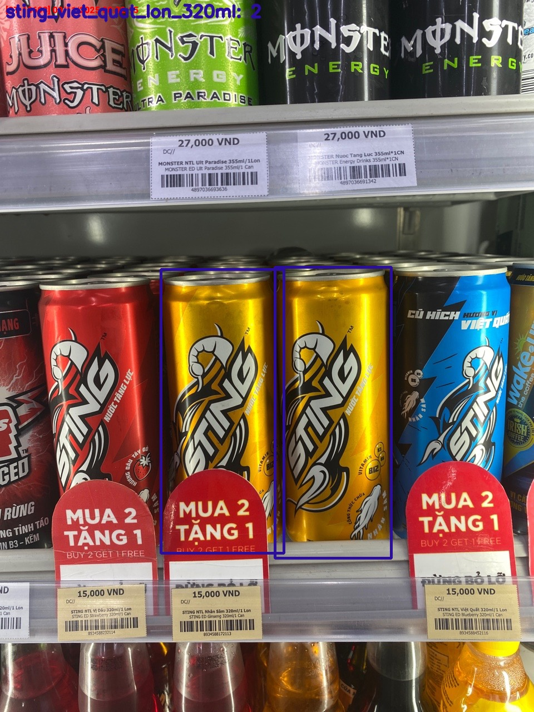 |

</div>

#### Test Image 2

<div align="center">

|          PyTorch Model           |           TFLite Float16            |
| :------------------------------: | :---------------------------------: |
| 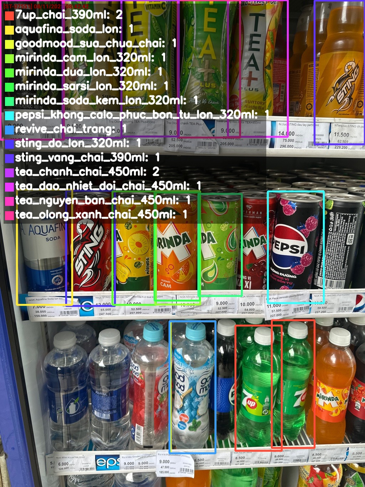 | 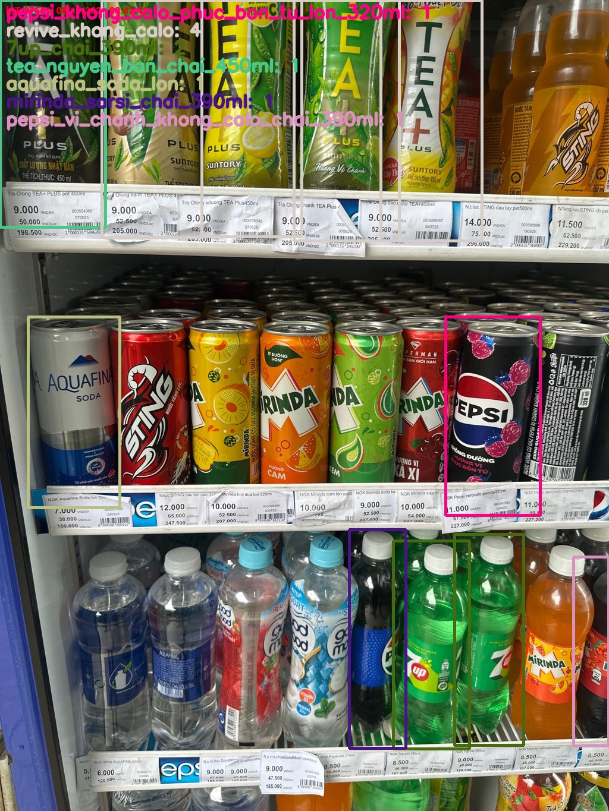 |

</div>

#### Test Image 3

<div align="center">

|          PyTorch Model           |           TFLite Float16            |
| :------------------------------: | :---------------------------------: |
| 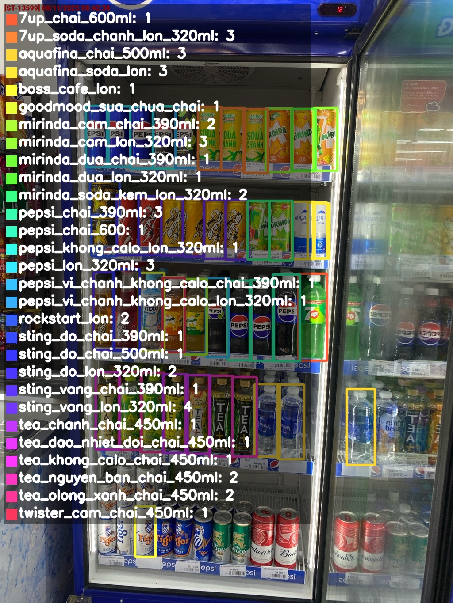 | 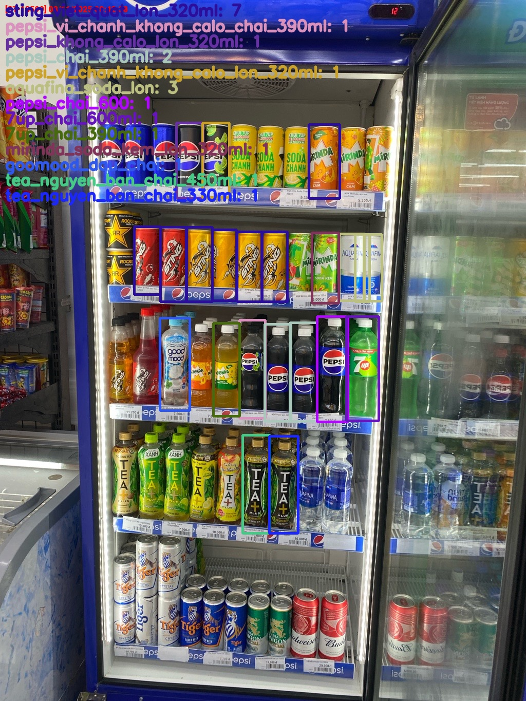 |

</div>

#### Test Image 4

<div align="center">

|          PyTorch Model           |           TFLite Float16            |
| :------------------------------: | :---------------------------------: |
| 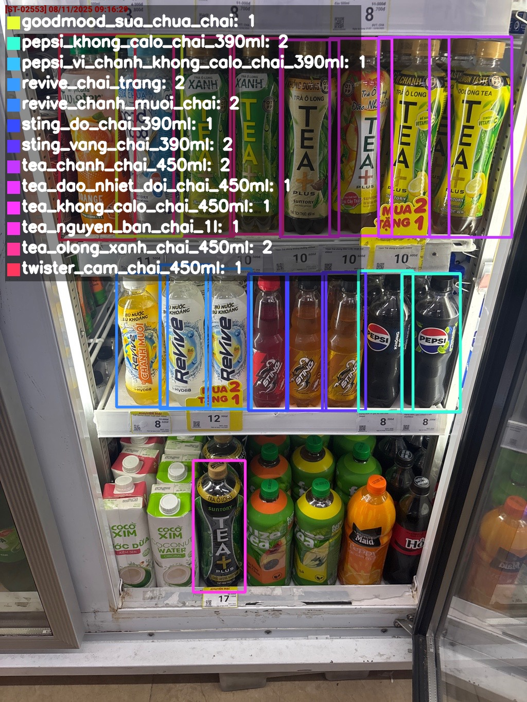 | 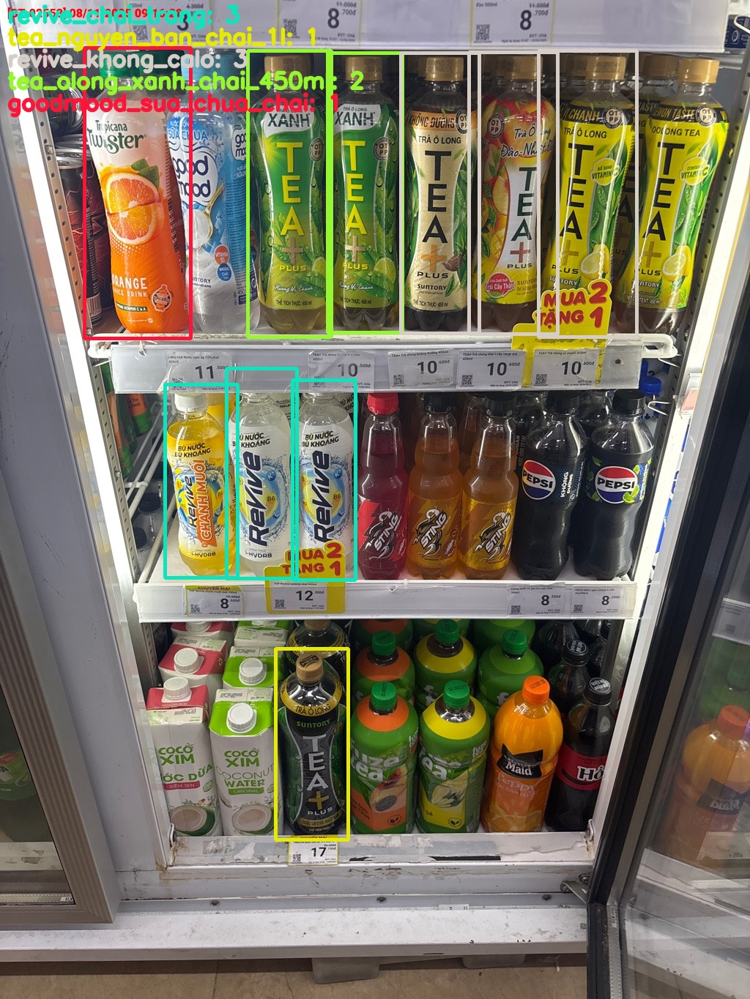 |

</div>

#### Test Image 5

<div align="center">

|          PyTorch Model           |           TFLite Float16            |
| :------------------------------: | :---------------------------------: |
| 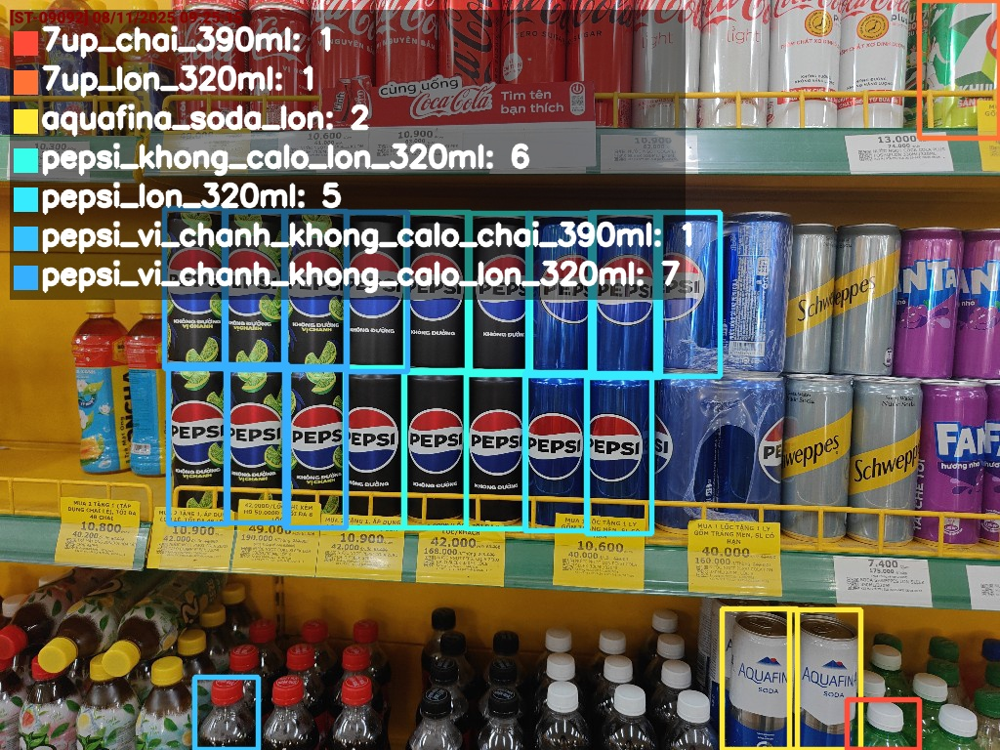 | 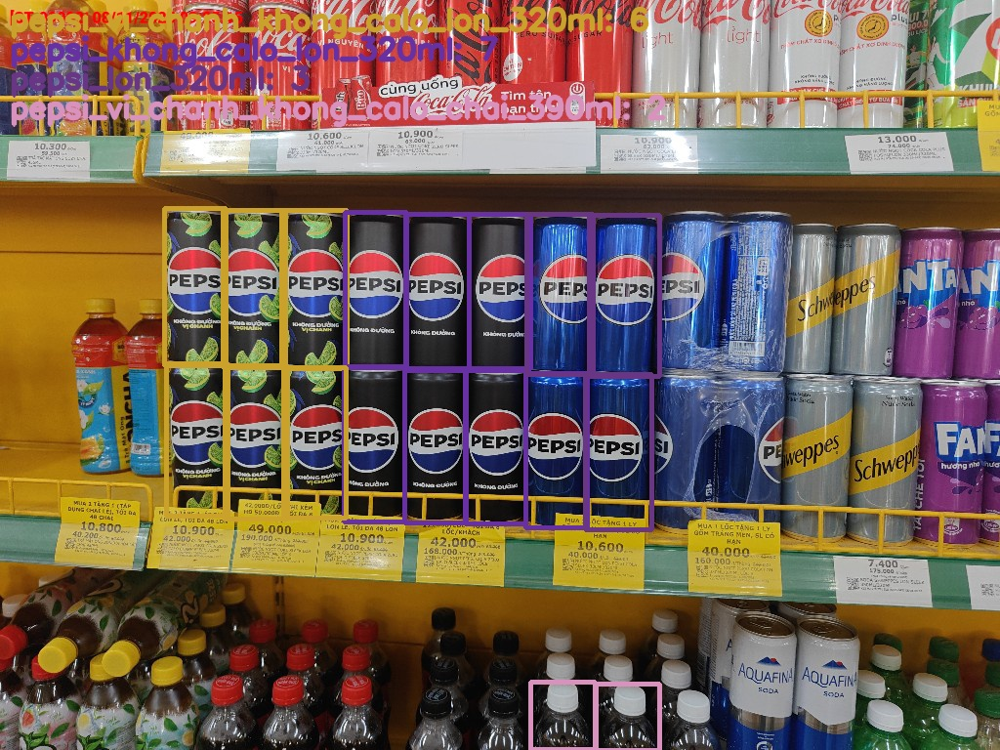 |

</div>

### 📊 Comparison Analysis

**Advantages of TFLite Float16:**

- 📦 **Model size reduced by ~50%** (from Float32 to Float16)
- ⚡ **Faster inference speed** on mobile devices
- 💾 **Memory efficient**, suitable for devices with limited RAM

**Accuracy:**

- ✅ **Maintains high accuracy** compared to original PyTorch model
- ✅ **Detection equivalent** to full precision model
- ⚠️ Minor differences in confidence scores possible (typically < 5%)
- ⚠️ In some complex cases, may miss a few low-confidence detections

**Conclusion:**

> 💡 **TFLite Float16** is the optimal choice for mobile deployment with an excellent trade-off between size, speed, and accuracy. The model is suitable for real-world applications requiring real-time detection on smartphones.

---

## 📱 Mobile Deployment

### Flutter Integration

The model has been successfully deployed on mobile application using **Flutter** framework with TensorFlow Lite.

### Demo Video


_Video demo of mobile app detecting PepsiCo products in real-time_

### Technical Specifications

- **Platform**: Android/iOS
- **Framework**: Flutter
- **ML Plugin**: `tflite_flutter`
- **Model**: `best_float16.tflite`
- **Input**: Real-time camera
- **FPS**: ~15-30 fps (device dependent)

### Features

- 📸 **Real-time Detection** via camera
- 🎯 **Bounding Box & Label** visual display
- 📊 **Confidence Score** for each detection
- 🔄 **Smooth Performance** on common devices

---

## 🛠 Installation & Usage

### System Requirements

```
Python >= 3.8
CUDA >= 11.0 (if training on GPU)
```

### Dependencies

```bash
pip install ultralytics
pip install opencv-python
pip install tensorflow
pip install numpy
```

### 1. Training Model

```python
python train.py
```

Training configuration in `train.py`:

- Model base: `yolo11n.pt`
- Data config: `data.yaml`
- Epochs: 40
- Batch size: 8
- Image size: 640

### 2. Testing with PyTorch Model

```python
python test_yolo.py --image rawtest/t1.jpg --model runs/detect/train/weights/best.pt
```

### 3. Testing with TFLite Model

```python
python test_yolo_tflite.py --model runs/detect/train/weights/best_saved_model/best_float16.tflite --image rawtest/t1.jpg --labels labels.txt
```

### 4. Inference/Prediction

```python
python predict.py
```

---

## 📁 Project Structure

```
pepsi_dt/
│
├── train.py                          # Model training script
├── test_yolo.py                      # Test with PyTorch model
├── test_yolo_tflite.py               # Test with TFLite model
├── predict.py                        # Inference script
├── data.yaml                         # Dataset configuration
├── labels.txt                        # List of 60 labels
├── yolo11n.pt                        # Pre-trained YOLOv11 Nano
│
├── rawtest/                          # Raw test images
│   ├── t1.jpg → t6.jpg
│
├── output/                           # Inference results
│   ├── out_t1.jpg → out_t5.jpg         # PyTorch model results
│   ├── out_tfl_t1.jpg → out_tfl_t5.jpg # TFLite model results
│   └── mobile_test.mp4                  # Mobile app demo
│
└── runs/detect/train/                # Training results
    ├── results.png                      # Training curves
    ├── confusion_matrix.png             # Confusion matrix
    ├── results.csv                      # Detailed metrics
    ├── *.jpg                            # Visualizations
    └── weights/
        ├── best.pt                      # Best PyTorch model
        ├── last.pt                      # Last checkpoint
        ├── best.onnx                    # ONNX export
        └── best_saved_model/
            ├── best_float32.tflite      # TFLite Float32
            ├── best_float16.tflite      # TFLite Float16 (quantized)
            └── saved_model.pb           # TensorFlow SavedModel
```

---

## 🚀 Roadmap

### Future Plans

- 🔄 **Larger dataset update** (target: 2000-3000 images)
- 📊 **Expand number of classes** (add new products)
- 🎯 **Improve accuracy** for products with similar packaging
- 🌐 **Collect more diverse data** (camera angles, lighting conditions)
- 📱 **Optimize mobile app** (increase FPS, reduce latency)
- 🔧 **Experiment with YOLOv11s/m** to improve accuracy
- 📈 **Advanced Data Augmentation** (Mosaic, MixUp, etc.)

---

## 🤝 Contributing

All contributions are welcome! If you want to contribute to this project:

1. 🍴 Fork the repository
2. 🔨 Create a new branch (`git checkout -b feature/AmazingFeature`)
3. 💾 Commit your changes (`git commit -m 'Add some AmazingFeature'`)
4. 📤 Push to the branch (`git push origin feature/AmazingFeature`)
5. 🎉 Open a Pull Request

### Ways to Contribute

- 📸 **Dataset contribution**: High-quality images of PepsiCo products
- 🐛 **Bug reports**: Create an issue if you find a bug
- 💡 **Feature suggestions**: Ideas to improve the project
- 📝 **Documentation improvements**: Add/modify README and docs
- 🧪 **Testing**: Test under various conditions

---

## 📄 License

This project is distributed under the **MIT License**. See the [LICENSE](LICENSE) file for more details.

Dataset on Roboflow: [CC BY 4.0 License](https://creativecommons.org/licenses/by/4.0/)

```
MIT License

Copyright (c) 2025 Pham Van Tien

Permission is hereby granted, free of charge, to any person obtaining a copy
of this software and associated documentation files (the "Software"), to deal
in the Software without restriction, including without limitation the rights
to use, copy, modify, merge, publish, distribute, sublicense, and/or sell
copies of the Software, and to permit persons to whom the Software is
furnished to do so, subject to the following conditions:

The above copyright notice and this permission notice shall be included in all
copies or substantial portions of the Software.

THE SOFTWARE IS PROVIDED "AS IS", WITHOUT WARRANTY OF ANY KIND, EXPRESS OR
IMPLIED, INCLUDING BUT NOT LIMITED TO THE WARRANTIES OF MERCHANTABILITY,
FITNESS FOR A PARTICULAR PURPOSE AND NONINFRINGEMENT. IN NO EVENT SHALL THE
AUTHORS OR COPYRIGHT HOLDERS BE LIABLE FOR ANY CLAIM, DAMAGES OR OTHER
LIABILITY, WHETHER IN AN ACTION OF CONTRACT, TORT OR OTHERWISE, ARISING FROM,
OUT OF OR IN CONNECTION WITH THE SOFTWARE OR THE USE OR OTHER DEALINGS IN THE
SOFTWARE.
```

---

## 👨‍💻 Author

**Pham Van Tien**

- 📧 Email: pvtienlamk@gmail.com
- 🔗 GitHub: [@phamvantienkiz](https://github.com/phamvantienkiz)
- 📂 Repository: [PepsiDrinkDetection](https://github.com/phamvantienkiz/PepsiDrinkDetection)

---

## 🙏 Acknowledgments

- 🎓 **Ultralytics** - YOLOv11 framework
- 🗂️ **Roboflow** - Dataset hosting platform
- 🏢 **PepsiCo** - Products in the dataset
- 💙 **Flutter Community** - Mobile development support

---

<div align="center">

### ⭐ If you find this project helpful, give it a Star! ⭐

Made with ❤️ in Vietnam 🇻🇳

**Happy Detecting! 🥤🔍**

</div>
